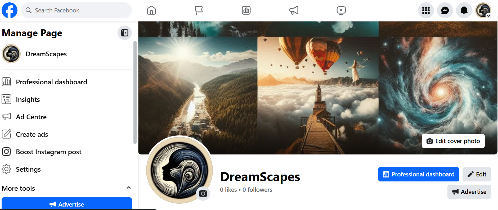
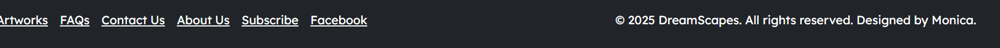

# DreamScapes E-commerce Platform  
A unique platform blending art and technology to bring dream-like landscapes to life.

## About  
**DreamScapes** is a visually captivating e-commerce platform offering unframed A4 art prints inspired by surreal, dream-like landscapes. Designed to merge artistic expression with modern web functionality, the site provides users with a smooth, aesthetically pleasing shopping experience.

The platform focuses on simplicity, responsiveness, and user-friendly navigation to cater to art lovers looking for elegant and customizable artwork.

- 🎨 **Live Site**: [DreamScapes on Heroku](https://dreamscapes-4bf65f774d22.herokuapp.com/)  
- 💳 **Test Card**: Use `4242 4242 4242 4242` with any valid expiry and CVC for test purchases (Stripe sandbox mode).
 


## User Experience Design

### 1. Strategy
- Prioritized **simplicity**, **accessibility**, and **visual appeal** to create an intuitive and enjoyable user experience.
- Designed to meet the needs of users seeking **high-quality**, **customizable** digital art prints.
- Emphasized fast navigation, clear call-to-action buttons, and a clutter-free interface to reduce friction during browsing and checkout.

### 2. Target Audience
- **Art enthusiasts** and interior decor lovers within the **United Kingdom**.
- Users who appreciate **clean, minimalist design** with the option to **personalize** or request **custom artwork**.
- Customers interested in supporting unique and exclusive art collections.

## Planning

### 1. Wireframes
- Wireframes were created to map out the structure and flow of the website before development.
- **Tool used:** Balsamiq  


### 2. Design
- The site design was built using **Bootstrap** for responsive layout and grid system.
- Custom styles were added via CSS to give the site a unique, artistic aesthetic.
- **Background image inspiration:**  
[Bed in the Clouds – Pexels](https://www.pexels.com/photo/bed-in-the-clouds-11643390/)
- Artwork images was created by me using AI. 

### 3. Lucid Board
- User journeys and workflows were mapped out using **Lucidchart**.


## Business Model

DreamScapes is an independent digital art platform that combines creativity and commerce. The business model is built around offering exclusive, dream-inspired artwork in both ready-to-purchase and customizable formats. The goal is to deliver high-quality visual pieces while maintaining accessibility and a personal customer experience.

### 1. Core Offerings

- **Art Print Sales:**  
  Customers can browse and purchase unframed A4 prints of dream-like digital artworks. These prints are carefully curated for aesthetic appeal, aligning with interior design trends and customer demand for unique visual pieces.

- **Custom Art Orders:**  
  Through a dedicated custom order form, users can request bespoke artwork tailored to their preferred size, theme, color palette, and style. This offering adds a personalized, premium dimension to the platform and is aimed at customers seeking one-of-a-kind decor or gifts.

### 2. Revenue Streams

- **Direct Sales:**  
  Revenue is generated through standard purchases of artwork displayed on the site.

- **Custom Orders (Premium Pricing):**  
  These are priced higher to reflect the time, creative effort, and consultation involved in producing bespoke pieces.

- **Future Opportunities:**
  - **Framed Prints:** Offering customers the option to purchase prints with frames, adding a convenient upsell opportunity.
  - **Digital Downloads:** Selling downloadable high-resolution art for customers who prefer to print at home.
  - **Merchandising:** In future, expanding into branded merchandise such as calendars, notebooks, and postcards featuring popular artwork.

### 3. Marketing and Customer Acquisition

DreamScapes aims to grow its audience through strategic digital marketing:

- **Search Engine Optimization (SEO):**  
  Web pages and product listings are optimized for search visibility, targeting keywords related to digital art, custom prints, and dream-inspired decor.

- **Email Marketing with Mailchimp:**  
  Visitors can subscribe to receive updates, special offers, and product launches via a sign-up form.  
  

- **Social Media (Facebook):**  
  A Facebook page helps build an engaged art-loving community, share new artwork, and drive targeted traffic to the store.  
  

- **Word of Mouth & Referrals:**  
  Positive customer experiences and visually appealing products are likely to lead to referrals and organic growth.

### 4. Value Proposition

DreamScapes offers:

- Affordable access to exclusive digital art.
- A user-friendly website for exploring and ordering art.
- A personalized experience through the custom order process.
- Transparent, secure checkout and delivery process.
- Aesthetic consistency and modern UI design across all touchpoints.

## Technologies Used

### 1. Languages
- **Python** – Back-end logic and data handling
- **HTML** – Markup structure for the web pages
- **CSS** – Styling and layout
- **JavaScript** – Interactive functionality (e.g., Stripe payments)

### 2. Frameworks and Libraries
- **Django** – Python-based web framework for building the back end
- **Bootstrap** – Responsive front-end design and layout

### 3. Databases
- **SQLite** – Used during local development
- **PostgreSQL** – Used in production on Heroku

### 4. Integrations and Services
- **Stripe** – Secure payment processing
- **Cloudinary** – Image and media hosting/storage
- **Mailchimp** – Newsletter and user signup integration

### 5. Development and Deployment Tools
- **Heroku** – Hosting and deployment
- **GitPod** – Cloud-based development environment
- **GitHub** – Version control and code repository
- **W3C Validator** – HTML and CSS code validation
- **PEP8** – Python style guide used for code validation
- **Favicon.io** – Tool used to generate the site’s favicon ([Favicon Generator](https://favicon.io/))

## Features

### 1. Design

DreamScapes features a clean, user-friendly interface that balances modern aesthetics with artistic flair. The layout is intuitive, making it easy for users to browse and navigate the platform, while subtle visual effects and themed elements reinforce the brand's artistic identity.

#### Key Pages

- **Landing Page**  
  A visually impactful homepage introducing the brand and inviting users to explore the art collection.  
  

- **Art Shop**  
  A gallery-style grid showcasing available A4-sized artworks. Each item includes a title, price, and quick access to detail pages.  
  

- **Art Detail Page**  
  A dedicated view of each artwork with a larger image, description, and an add-to-cart option.  
  

- **FAQs Page**  
  A help section answering common customer questions related to orders, delivery, and customization.  
  

#### Responsive Design

The entire site is built using Bootstrap to ensure responsiveness across all devices, from desktop to mobile. Key responsive elements include:

1. **Navbar**  
   A collapsible navigation bar with a toggle button and dropdown menu for small screens.  
   

2. **Footer**  
   Includes quick links to important pages and a Facebook link, laid out in a grid for consistent display.  
   

3. **Pop-up Messages**  
   Flash messages are styled for visibility and include close buttons to dismiss them.  
   

### 2. Colour Scheme

The site uses calming shades of blue and purple, chosen to evoke a dreamy and peaceful aesthetic that aligns with the brand’s theme.

### 3. Imagery

Every piece of artwork on the platform was custom-created to reflect dream-like environments. The use of original imagery ensures uniqueness and exclusivity for customers. All prints are presented in A4 size and are sold unframed for flexible display options.

# Information Architecture

## Project Structure

```bash
DreamScapes/
├── dreamscapes/         # Project configuration
├── home/                # Landing page, FAQs, contact form
├── artworks/            # Display, detail, and filtering of art
├── orders/              # Cart, checkout, and order processing
├── users/               # Authentication and profile management
├── templates/           # HTML templates
├── static/              # CSS, JavaScript, images
├── media/               # Uploaded artwork
├── manage.py            # Django management tool
├── db.sqlite3           # Development database
└── requirements.txt     # Project dependencies
```

## Database Design

A well-structured relational database is implemented using Django models to store and manage user accounts, custom orders, artworks, and transactions.

Models follow Django conventions and make use of **relational fields** to maintain data integrity.

## Entity Relationship Diagram (ERD)

Please follow here for the [`ERD.md`](ERD.md) file.

## Testing

DreamScapes was tested thoroughly using a combination of manual testing, validator tools, test-driven development (TDD), and behavior-driven development (BDD) based on user stories.

### 1. Manual Testing

All core features were manually tested for correct behavior and usability. This included:

- Navigation bar and footer links
- Page responsiveness on different screen sizes
- Form validation (login, signup, shipping, custom orders)
- Flash messages (success/error feedback)
- Stripe payment flow and order confirmation

Test cases and results are documented in the [`TESTING.md`](TESTING.md) file.

### 2. Test-Driven Development

Key functionality was implemented using user stories with BDD-style acceptance criteria and scenarios. These included:

- Viewing artwork details  
- Adding and removing items from the cart  
- Submitting and managing custom artwork requests  
- Completing a purchase with valid delivery and payment information  
- Viewing past orders from the user dashboard

Examples of user stories and corresponding BDD scenarios are also included in [`TESTING.md`](TESTING.md).

### 3. Validators

All templates were passed through:

- [W3C HTML Validator](https://validator.w3.org/)
- [W3C CSS Validator](https://jigsaw.w3.org/css-validator/)
- Python code was validated with [PEP8](https://www.python.org/dev/peps/pep-0008/) via the flake8 tool.

PEP8

CSS

Lighthouse

HTML


Please refer to the [`TESTING.md`](TESTING.md) for all html passes. 

# Bugs & Fixes

This section outlines bugs encountered during development and how they were resolved.

| Bug ID | Description | Status | Fix |
|--------|-------------|--------|-----|
| 1 | **Navbar collapsing issue on smaller screens.** The hamburger icon appeared but links weren't visible. | ✅ Fixed | Added `navbar-toggler` and ensured correct `data-bs-*` attributes were in place. Verified with Bootstrap 5 docs. |
| 2 | **Delivery details not saving correctly.** Form submitted but data wasn't stored. | ✅ Fixed | Reordered logic to save shipping details before Stripe intent was created. Confirmed correct form validation. |
| 3 | **Background image not loading.** No visual update on home page despite styling. | ✅ Fixed | Realized `DEBUG` was `False` during development, preventing static files from updating. Switched it on to see changes. |
| 4 | **Footer not sticking to bottom.** Footer floated mid-screen on short content pages. | ✅ Fixed | Used flexbox with `min-height: 100vh` and `flex-direction: column` on `body`, and `mt-auto` on the footer. |
| 5 | **Cart not updating correctly.** Removing an item didn’t update the total price. | ✅ Fixed | Corrected cart logic in the view and ensured session was updated after item deletion. |
| 6 | **Order Detail page causing 500 error.** Clicking an order broke the page. | ✅ Fixed | Caused by missing `artwork_detail` URL in loop link. Wrapped in an `if artwork` condition and fixed the template path. |
| 7 | **404 page not connected.** Broken links redirected to default Django 404. | ✅ Fixed | Created a custom `404.html` template and updated `handler404` in `urls.py`. |
| 8 | **Custom order form validation errors not displaying.** Users saw no feedback. | ✅ Fixed | Added `form.errors` block in template and used `{{ form.field.errors }}` per field. |
| 9 | **Logged-out users accessing protected routes.** Users could manually enter profile URLs and access restricted pages. | ✅ Fixed | Added `@login_required` decorators and checks in views for authenticated users. |
| 10 | **Stripe card element not rendering.** The form appeared blank on the checkout page. | ✅ Fixed | Script was loading before the DOM was ready. Moved Stripe script to bottom of page and ensured JS loaded after elements. |
| 11| **Help text triggering ARIA validation errors.** `aria-describedby` pointed to non-existent IDs. | ✅ Fixed | Manually added matching `<small id="...">` elements below each input or removed the attribute where unused. |
| 12 | **Profile update form not saving changes.** Users saw no errors but info didn’t change. | ✅ Fixed | Overwrote the `__init__()` method incorrectly. Updated logic to use `instance=request.user` properly in view. |
| 13 | **Mobile menu overlapping page content.** Navbar dropdown remained open and obscured page content. | ✅ Fixed | Added `z-index` and closed mobile menu on link click using JavaScript. |
| 14 | **New users couldn’t sign up.** Form submitted but account wasn’t created, and no error was shown. | ✅ Fixed | Added error handling and checked that the registration view was saving the user correctly. Ensured form used `UserCreationForm` and included required fields in `forms.py`. |
| 15 | **Product images not displaying on deployed site.** Thumbnails broken on Heroku. | ✅ Fixed | Adjusted `Cloudinary` settings and ensured `MEDIA_URL` and `CloudinaryStorage` were correctly configured. |

## Deployment
- This project was deployed locally first and then hosted on Heroku. Follow these steps to set up and deploy the project: [Deployment file](deployment.md)

## Future Enhancements

- **Framed Print Options**: Offer customers the ability to select framing options at checkout.
- **International Shipping**: Expand shipping beyond the UK to reach a global customer base.
- **Live Artwork Customization Preview**: Allow users to see a visual mock-up of their custom order before submission.
- **User Behavior Analytics**: Implement advanced tracking to monitor user interactions and optimize UX.
- **Image Watermarking**: Apply watermarks to artwork previews to prevent unauthorized use prior to purchase.


## Summary

DreamScapes is the result of a rewarding yet challenging journey, where technical precision met artistic expression to create a unique e-commerce platform. The project was shaped by tight time constraints and unforeseen hurdles, demanding creative problem-solving and adaptability throughout the process.

### Time Limitations
Delivering a functional platform within a set timeframe required prioritizing essential features while scaling back or postponing certain enhancements. This approach ensured the project remained focused and achievable without compromising on user experience or core functionality.

### Overcoming Challenges
Building DreamScapes involved tackling complex technical challenges:

- **Payment Integration**: Stripe required meticulous debugging to guarantee secure and seamless transactions.
- **Responsive Design**: Bootstrap styling necessitated iterative refinements to achieve consistent spacing and responsiveness.
- **Custom Artwork Functionality**: Designing and implementing forms demanded careful database structuring and troubleshooting.

Despite these obstacles, solutions often involved creative compromises, such as simplifying workflows, streamlining operations, and embracing innovative tools.

### Lessons Learned
The challenges faced during the project were opportunities for growth and skill enhancement. Learning to work within limitations fostered resourcefulness and efficiency, while tackling technical issues improved problem-solving skills and confidence.

DreamScapes stands as a testament to the power of perseverance and passion. It not only serves as a platform for showcasing dream-like artwork but also reflects the dedication and creativity poured into its development. With future enhancements on the horizon, DreamScapes is ready to continue evolving and inspiring art lovers everywhere.

## Content

This project was designed and developed by **Monica Thomas** as part of the **Code Institute Full-Stack Development Diploma**.

## Credits

DreamScapes was developed with the support of various tools, frameworks, and documentation that guided the implementation of essential features. Special thanks to the following resources:

- [Bootstrap Documentation](https://getbootstrap.com/) – For providing detailed guidance on implementing responsive design and cohesive styling across the platform.
- [Stripe Documentation](https://stripe.com/docs) – For comprehensive instructions on integrating secure payment processing seamlessly into the checkout workflow.
- [Cloudinary Documentation](https://cloudinary.com/documentation) – For facilitating efficient media storage and management, ensuring high-quality images are served throughout the site.
- [Tech With Tim – Django Beginner Tutorial](https://youtu.be/sm1mokevMWk?si=x647nUCIvSpyD2lU)
- [Programming with Mosh – Django Full Course](https://youtu.be/rHux0gMZ3Eg?si=SBKdrSZ061fcF1YV)

Additionally, the Django framework and its community resources played a crucial role in building the backend logic and overall structure of the platform. Tutorials, blogs, and mentors also provided valuable insights along the way.

## Acknowledgements

- Special thanks to the **Code Institute** community for continuous encouragement and support.
- Grateful appreciation to my mentor **Iuliia Konovalova** for her insightful feedback, expert guidance, and motivation throughout the development of this project.
