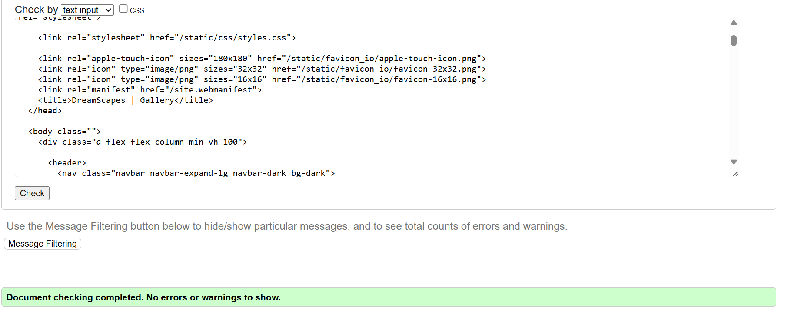

# TESTING.md – DreamScapes

## 1. Overview

This document outlines the testing strategy used in the development of the **DreamScapes** project. It includes:

- Manual testing of key features  
- Test-driven development (TDD) via user stories and scenarios  
- HTML/CSS/Python validation  
- Browser and device compatibility checks

## 2. Manual Testing

### General UI Tests

| Feature         | Action                     | Expected Result                            | Pass/Fail |
|----------------|----------------------------|---------------------------------------------|-----------|
| Navigation Bar | Click all nav links        | Navigate to correct pages                   | ✅         |
| Footer         | View on every page         | Fixed at bottom, responsive on all devices  | ✅         |
| Flash Messages | Submit forms/interactions  | Display appropriate success/error messages  | ✅         |

### Form Tests

| Form            | Action                          | Expected Result                             | Pass/Fail |
|-----------------|----------------------------------|----------------------------------------------|-----------|
| Login Form      | Valid/Invalid login              | Login succeeds or shows error                | ✅         |
| Sign Up Form    | Password mismatch/empty fields   | Error displayed and form reloaded            | ✅         |
| Custom Order    | Submit valid/invalid data        | Form saves or displays errors                | ✅         |
| Shipping Info   | Submit valid/invalid info        | Saved to session/order, or validation error  | ✅         |
| Update Profile  | Change details and submit        | Info updated in database                     | ✅         |

### Functional Tests

| Feature         | Scenario                        | Expected Result                             | Pass/Fail |
|----------------|----------------------------------|----------------------------------------------|-----------|
| Add to Cart     | Click 'Add to Cart'              | Item added and shown in cart                 | ✅         |
| Remove from Cart| Click 'Remove' button            | Item removed from cart                       | ✅         |
| Checkout        | Fill delivery, pay via Stripe    | Order completed and confirmation shown       | ✅         |
| Order History   | View dashboard                   | Previous orders displayed correctly          | ✅         |
| Order Detail    | Click on past order              | Detailed view with items                     | ✅         |
| Custom Order Edit/Delete | Manage own requests     | Able to modify or delete successfully        | ✅         |

## 3. Test-Driven Development (TDD)

This project followed a BDD-style approach, developing key features based on user stories and scenarios written before implementation.

*Refer to the "Testing" section of the README for full breakdowns.*

Examples:
- Viewing Artwork Details
- Adding Items to Cart
- Checking Out & Payments
- Requesting Custom Artwork
- Tracking Order History
- Searching for Artwork

## 4. Validator Testing

| Tool                | Target                     | Result            |
|---------------------|----------------------------|-------------------|
| W3C HTML Validator  | All templates               | ✅ Passed         |
| W3C CSS Validator   | styles.css                  | ✅ Passed         |
| PEP8                | Python files                | ✅ Minor issues resolved |
| Lighthouse          | Multiple pages tested       | ✅ Good performance, SEO, accessibility |

## 5. Browser & Device Testing

| Device/OS        | Browser         | Result |
|------------------|------------------|--------|
| Windows 10       | Chrome, Edge     | ✅     |
| macOS Ventura    | Safari, Chrome   | ✅     |
| iPhone 16 (iOS)  | Safari, Chrome   | ✅     |
| Samsung Galaxy   | Chrome           | ✅     |
| Responsive Tool  | All breakpoints  | ✅     |

## 6. BDD testing with User stories

### Viewing Artwork Details

| Scenario                                      | Expected Result                     | Passed |
|----------------------------------------------|-------------------------------------|--------|
| User is on Shop page and clicks artwork      | Redirect to detail page             | ✅     |
| User views image section on detail page      | High-res image is shown             | ✅     |
| User scrolls to artist section               | Artist name and bio are displayed   | ✅     |

### Adding Items to Cart

| Scenario                                      | Expected Result                     | Passed |
|----------------------------------------------|-------------------------------------|--------|
| User clicks 'Add to Cart' on detail page     | Item is added to cart               | ✅     |
| User clicks 'Remove' in cart                 | Item is removed from cart           | ✅     |

### Checking Out & Making Payments

| Scenario                                      | Expected Result                          | Passed |
|----------------------------------------------|------------------------------------------|--------|
| User goes to checkout with items             | List of items is displayed               | ✅     |
| User reviews summary                         | Breakdown of costs is shown              | ✅     |
| User enters payment details                  | Stripe processes payment securely        | ✅     |
| User completes payment                       | Confirmation message is shown            | ✅     |

### Requesting Custom Artwork

| Scenario                                      | Expected Result                          | Passed |
|----------------------------------------------|------------------------------------------|--------|
| User fills out custom order form             | Form accepts required details            | ✅     |
| User submits form                            | Order is saved to database               | ✅     |
| Submission processed                         | Confirmation message is shown            | ✅     |

### Tracking Order History

| Scenario                                      | Expected Result                          | Passed |
|----------------------------------------------|------------------------------------------|--------|
| User logs in and goes to dashboard           | Previous orders are listed               | ✅     |
| User views order list                        | Artwork, date, and status shown          | ✅     |
| User clicks order                            | Order detail page is displayed           | ✅     |

### Validator Testing

Home

About

Contact Us

FAQs

Subscribe

Artwork

Artwork Detail

Shopping Cart

Shipping Info

Payment

Thnak you

Update Profile

Custom Order

Dashboard

Edit Custom Order

Delete Custom Order

Sign Up

Login

Log Out

